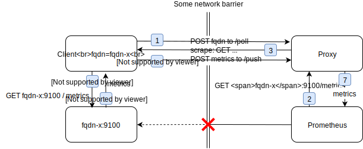

# PushProx [](https://circleci.com/gh/prometheus-community/PushProx)

PushProx is a client and proxy that allows transversing of NAT and other
similar network topologies by Prometheus, while still following the pull model.

While this is reasonably robust in practice, this is a work in progress.

## Running

First build the proxy and client:

```
git clone https://github.com/prometheus-community/pushprox.git
cd pushprox
make build
```

Run the proxy somewhere both Prometheus and the clients can get to:

```
./pushprox-proxy
```

On every target machine run the client, pointing it at the proxy:
```
./pushprox-client --proxy-url=http://proxy:8080/
```

In Prometheus, use the proxy as a `proxy_url`:

```
scrape_configs:
- job_name: node
  proxy_url: http://proxy:8080/
  static_configs:
    - targets: ['client:9100']  # Presuming the FQDN of the client is "client".
```

If the target must be scraped over SSL/TLS, add:
```
  params:
    _scheme: [https]
```
rather than the usual `scheme: https`. Only the default `scheme: http` works with the proxy,
so this workaround is required.

## Service Discovery

The `/clients` endpoint will return a list of all registered clients in the format
used by `file_sd_configs`. You could use wget in a cronjob to put it somewhere
file\_sd\_configs can read and then then relabel as needed.

## How It Works



Clients perform scrapes in a network environment that's not directly accessible by Prometheus.
The Proxy is accessible by both the Clients and Prometheus.
Each client is identified by its fqdn.

For example, the following sequence is performed when Prometheus scrapes target `fqdn-x` via PushProx.
First, a Client polls the Proxy for scrape requests, and includes its fqdn in the poll (1).
The Proxy does not respond yet.
Next, Prometheus tries to scrape the target with hostname `fqdn-x` via the Proxy (2).
Using the fqdn received in (1), the Proxy now routes the scrape to the correct Client: the scrape request is in the response body of the poll (3).
This scrape request is executed by the client (4), the response containing metrics (5) is posted to the Proxy (6).
On its turn, the Proxy returns this to Prometheus (7) as a reponse to the initial scrape of (2).

PushProx passes all HTTP headers transparently, features like compression and accept encoding are up to the scraping Prometheus server.

## Security

You can enable basic auth by providing `--web.auth.username` and `--web.auth.password` to protect proxy requests and `/clients` endpoint.
Also there is possibility to disable `/clients` listing with `--web.disable-clients` to prevent discovery of clients if that's not needed for your use case.
